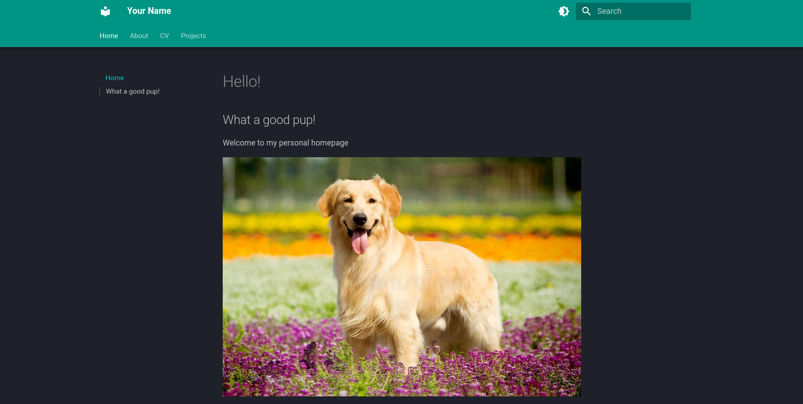
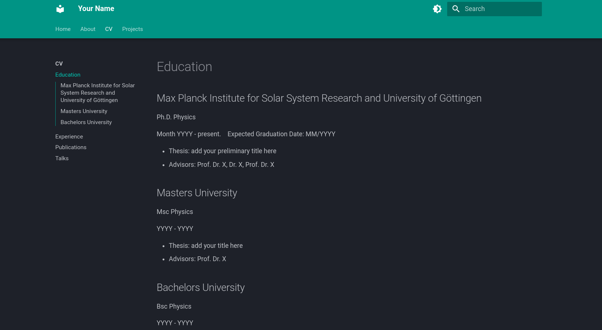
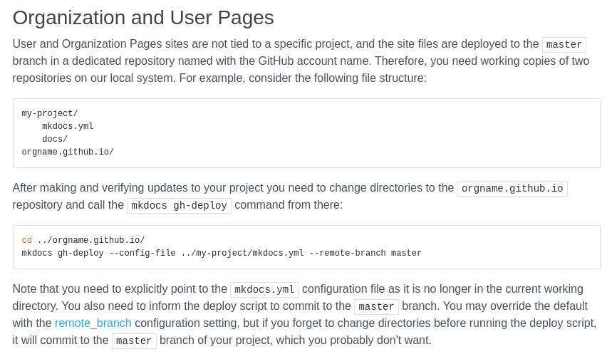

This is a themed version of Material as a template to create a simple static academic personal homepage.

This uses markdown files to provide the contents of the different webpages.





To setup 

```bash
git clone https://github.com/JonasSinjan/personal_homepage.git

conda env create --name personal_homepage --file=environment.yml

mkdocs serve
```

To deploy to your Github User Page (free yourusername.github.io website domain)

You need to follow: https://www.mkdocs.org/user-guide/deploying-your-docs/



The master config file: `mkdocs.yml`

- this is what `mkdocs` uses to build the page
- if there is an error in that file, the pages will fail to build
- the file structure within `docs` folder is essential, that is where mkdocs looks for the contents to build the page

Change your name in the mkdocs.yml!

Social links (bottom right corner on page)

- change the link locations
- Search for extra icons here: https://squidfunk.github.io/mkdocs-material/reference/icons-emojis/#search
- if it can't find the icon, there will be an error and the website will not build

Content pages

- update the .md files as you please
- add new .md files
- the file structure is just critical for mkdocs to build the pages
- replicate what was done before to ensure it works

Colours:

- https://squidfunk.github.io/mkdocs-material/setup/changing-the-colors/

Of course, feel free to change this how you like.

For the full guide of how to setup pages with the material theme see: https://squidfunk.github.io/mkdocs-material/setup/

Author: Jonas Sinjan 2023